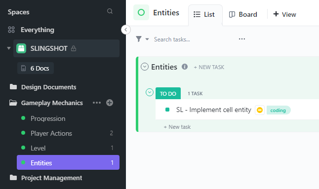

[[Back to Main Page]](README.md/#production-guide-for-solo-game-development)

# Pre-Production

During Pre-Production, you are going to hash out the most important design decisions. This is done through an iterative process of design and prototyping. You will also consider the resources that will be needed and draw up a plan for the realisation of your game - including an initial timeline - so that you can move on to Production.

## Table of Contents

> 1. [Setting Up A Backlog](#backlog)
> 2. [Creating A Game Design Document](#game-design-document)
>    - 2.1 [Structure](#structure)
>    - 2.2 [Elements](#elements)
>    - 2.3 [Modular Approach](#modular-approach)
>    - 2.4 [Iteration](#iteration)

## 1. Setting Up A Backlog

A central element of the development of your game is the backlog. It serves as an important project management framework, hosting all of the design documents, all tasks that need to get done, as well as a project timeline with milestones and due dates.

Because you are about to create important design documents, it makes sense to set up the backlog early. To begin with, you really only need to *create a dedicated space for your game project, with the ability to add documents and tasks as you go along* (you should start by integrating the Game Concept designed in the previous phase).

There are different project management applications that can be used for this, but my personal pick is [ClickUp](https://www.clickup.com/):

It is extremely feature-rich and customizable (even the free version). This might make it a bit too much for your first project though, so feel free to use alternatives for your own backlog (i've heard about [Nuclino](https://nuclino.com/), [Milanote](https://milanote.com/) and others).

The specifics of the backlog structure can vary drastically depending on what type of game you are making. Still, if you are going with ClickUp, [here](https://app.clickup.com/template/project/t-90040105296/d6e92afd78aea9a) you can find a template for a space dedicated to the `SLINGSHOT` project used as an example earlier.

## 2. Creating A Game Design Document

What follows is the creation of the most important document of this phase, the Game Design Document (GDD). It will serve as a blueprint for the entire project and builds upon the rough outline provided by the Game Concept.

### 2.1 Structure

First, i will provide a - quite expansive - **example** structure for the document. While smaller games will not require all of the sections listed, it is helpful to get an overview of what kinds of things *could* be relevant when designing your game:

1. [Introduction](#elements-introduction)
   - 1.1 Overview
   - 1.2 Purpose
   - 1.3 Audience
   - 1.4 Scope
   - 1.5 References
2. Game Overview
   - 2.1 [Game Concept](#elements-game-concept)
   - 2.2 [Design Pillars](#elements-design-pillars)
   - 2.3 [Narrative Pillars](#elements-narrative-pillars)
   - 2.4 [Look And Feel](#elements-look-and-feel)
3. [Walkthrough](#elements-walkthrough)
4. Game World
   - 4.1 Overview
   - 4.2 Lore
   - 4.3 Locations
5. [Story](#elements-story)
   - 5.1 Overview
   - 5.2 Characters
   - 5.3 Plot
6. Gameplay Mechanics
   - 6.1 [Player Actions](#elements-player-actions)
   - 6.2 [Environmental Interactions](#elements-environmental-interactions)
   - 6.3 [Narrative Mechanics](#elements-narrative-mechanics)
   - 6.4 [Systems](#elements-systems)
   - 6.5 Entities
   - 6.6 Upgrades
7. [Levels And Objectives](#elements-levels-and-objectives)
   - 7.1 Overview
   - 7.2 Objectives
   - 7.3 Level-Specific Gameplay Mechanics
8. User Interface And HUD
   - 8.1 Menu Design
   - 8.2 In-game UI Elements
   - 8.3 HUD design
9. Art Style And Graphics
   - 9.1 Art Style
   - 9.2 Character Design
   - 9.3 Environmental Design
   - 9.4 Special Effects And Particle Systems
10. Sound Design And Music
    - 10.1 Sound Effects
    - 10.2 Background Music And Score
    - 10.3 Voice acting
11. Multiplayer And Online Features
    - 11.1 Multiplayer Modes
    - 11.2 Online Features And Connectivity
    - 11.3 Matchmaking And Ranking Systems
12. Development And Production
    - 12.1 Milestones
    - 12.2 Production Timeline
    - 12.3 Budget And Resources Required
    - 12.4 Tools And Software Used
12. Conclusion
    - 12.1 Summary
    - 12.2 Future Plans
    - 12.3 Appendices

The structure of a GDD can and will change from project to project. Not every game project will need all of the elements listed above. To provide a concrete example, you can find the GDD for the `SLINGSHOT` project [here](https://share-docs.clickup.com/9004010474/d/h/8cawjza-41/20c1c286a990252). You will notice that several points have been altered or are left out to fit the scope and genre of the game.

### 2.2 Elements

Before continuing, i will go more into detail for some of the elements listed above.

#### Introduction
Document-related info.

#### Game Concept
Link to previously created Game Concept.

#### Game Design Pillars
List 3-5 key design pillars describing the gameplay, for example:

1. Fast: The action should start right away. Player movement should feel quick and agile. When players die, they should be able to start over immediately.
2. Emergent: The game should have very simple player actions and objectives, but create increasingly complex situations through the interaction of various game systems.
3. Learning through playing: The player should learn how the game's ecosystem works through trial and error. In the early stages of the game, dying should feel like learning and inspire a desire to try again, while later in the game the thrill comes from seeing how far you can push your highscore.

#### Narrative Pillars
Repeat the same thing for the game's narrative.

#### Look And Feel
Describe the game's aesthetic and game feel with precise vocabulary, for example:

1. Retro: The game should have a low-res, retro look with abstract visuals.
2. Surreal: The ecosystem of this game should feel very strange and dream-like, and the visuals of the game overall should reflect that.
3. Squishy: The game should have a satisfying and organic game feel with lots of squishy animations.

#### Walkthrough
Write a short second-preson walkthrough of an example play session. This should not be too long, but provides a good overview of the chronological *experience* of playing the game, before isolating and categorizing the individual game elements. 

#### Story
Provide a first outline of the story. Key characters and plot points - from start to finish - should be worked out now, during Pre-Production (of course things can still change later on). Detailed writing will happen in the Production phase.

#### Player Actions
List and describe the core player actions and how they work specifically, including movement, combat actions, etc.

#### Environmental Interactions
List and describe important environmental interactions, like opening doors, etc.

#### Narrative Mechanics
List and describe important narrative mechanics, like a dialogue system, etc.

#### Systems
List and describe important systems (that don't fall into the previous categories), like scoring systems, upgrade systems, etc.

#### Levels And Objectives
Provide and overview of the different levels, their objectives, and list level-specific gameplay mechanics. This is only an outline, the details for individual levels should be in a seperate document created during Production.

### 2.3 Modular Approach

XXX

### 2.4 Prototyping

Prototyping your game means creating a working model of the Game Concept in order to test its feasibility, functionality, and fun factor. It's an essential step in game development that allows developers to experiment with different mechanics, gameplay systems, and visual styles before committing to a full-scale production. Prototyping allows developers to test their game ideas quickly and cheaply, identify potential problems, and make changes to refine the core mechanics and gameplay systems. It's an iterative process that can help developers make better design decisions and create a more polished and enjoyable final product.

Prototyping is an essential step in game development that helps you test and refine the core mechanics and gameplay systems of your game idea. By following these steps, you can create a prototype that accurately reflects your game's vision:
1. Define the *Core Gameplay Mechanics*: Before you start prototyping your game, it's important to define the core gameplay mechanics that you want to test. This will help you stay focused and ensure that your prototype is effective in assessing the feasibility of your game idea. Write down the core mechanics, including how they work and how they interact with one another.
2. Create a *Paper Prototype*: A paper prototype is a low-cost way to quickly iterate on game mechanics and gameplay systems. Draw out the game board or level on paper and create pieces to represent the player and other game objects. Playtest the paper prototype to see if the core mechanics are engaging and fun.
4. Create a *Digital Prototype*: Once you have a solid paper prototype, it's time to create a digital prototype using your chosen game engine or prototyping tool. Create a simple level or game board and add the core mechanics from your paper prototype. Test the prototype with friends or colleagues to get feedback on gameplay and functionality.
5. *Iterate* and Refine: Use feedback from playtests to refine the core mechanics and gameplay systems. Make changes to the digital prototype and test it again. Iterate as many times as necessary until you have a solid prototype that accurately reflects your game's vision.
6. Add *Visuals and Audio*: Once the gameplay systems are refined and working well, it's time to add visuals and audio to the prototype. This will give you a sense of how the game will look and sound, and will help you decide on the art style and audio direction for the final game.
7. *Test* and Iterate Again: Once you have a working prototype with visuals and audio, test it again with a wider group of people. Use feedback to refine the game and iterate until you have a prototype that accurately reflects your game's vision and is fun to play.