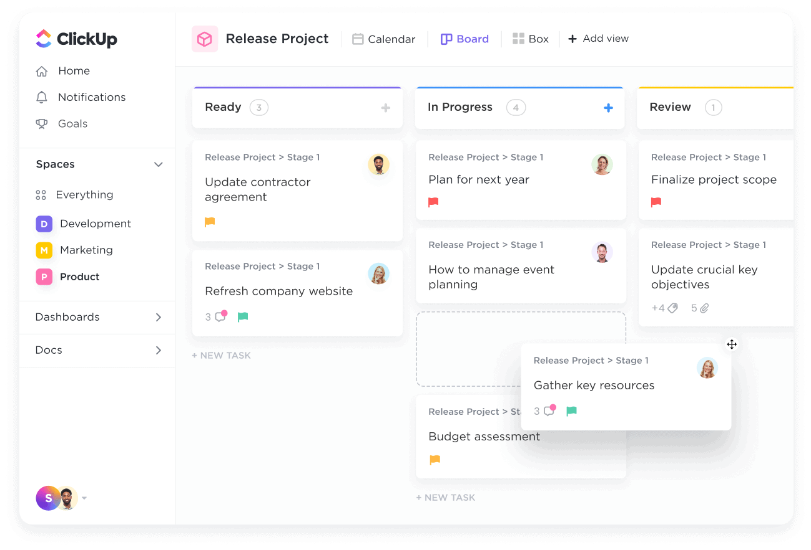

[[Back to Main Page]](README.md/#production-guide-for-solo-game-development)

# Pre-Production

During `Pre-Production`, you are going to hash out the most important design decisions. This is done through an iterative process of design and prototyping. You will also consider the resources that will be needed and draw up a plan for the realisation of your game - including an initial timeline - so that you can move on to Production.

## Table of Contents

> 1. [Setting Up A Backlog](#backlog)
> 2. [Creating A Game Design Document](#game-design-document)
>    - 2.1 [Structure](#structure)
>    - 2.2 [Elements](#elements)
> 3. [Managing Risks](#managing-risks)
>    - 3.1 [Risk Analysis](#risk-analysis)
>    - 3.2 [Prototyping](#prototyping)
> 4. [Funding](#funding)

---

## 1. Setting Up A Backlog

A crucial part of your game's development is the backlog. It serves as an important project management framework, housing all the design documents, all the tasks that need to be done, and a project timeline with milestones and due dates.

Since you are about to create important design documents, it makes sense to set up the backlog early. To begin with, you really only need to *create a dedicated space for your game project, with the ability to add documents and tasks as you go along* (you should start by integrating the game concept you created in the previous phase). Many of the tasks will come directly from the game design document created in the next step, and can be written as a list of features to be implemented. Of course, you may also want to create task lists for administrative work, etc.

There are different project management applications that can be used for this, but my personal pick is [ClickUp](https://www.clickup.com/):

It is extremely feature-rich and customizable (even the free version). This might be a bit much for your first project though, so feel free to use alternatives for your own backlog (I've heard of [Nuclino](https://nuclino.com/) and [Milanote](https://milanote.com/)).

The specifics of the backlog structure can vary drastically depending on what kind of game you are making. However, if you are using ClickUp, you can find a template for a space dedicated to the `SLINGSHOT` project [here](https://app.clickup.com/template/project/t-90040105296/d6e92afd78aea9a).

[[Back to Top]](#pre-production)

---

## 2. Creating A Game Design Document

What follows is the creation of the most important document of this phase, the Game Design Document (GDD). It will serve as a blueprint for the entire project, and as a production plan. The general *vibe* of the document is to specify the *design* of the game's elements, such as mechanics, in as much detail as possible, while reserving the actual creation of the game's *content* for the production phase.

You should create a first draft of this document, then complete and refine it through proper risk analysis (see 3. [Managing Risks](#managing-risks)).  Afterwards, you will have a comprehensive document with all of the design specifications neccessary to realize the game from start to finish - even though you will probably be making further adjustments during production.

Below is a - rather detailed - *example* structure for the document, as well as detailed information on specific elements. While smaller games won't need all of the sections listed, it's helpful to get an overview of what kinds of things *could* be relevant when designing your game.

But before that, here are some general notes and ideas about creating the Game Design Document:
- As explained in 1. [Setting Up A Backlog](#backlog), you should integrate the GDD into your backlog. Depending on the project management tool you use, this may allow you to reference specific parts of the GDD in tasks or other documents.
- Even with a comprehensive structure like the one below, the individual elements should be kept short and to the point. You can use bullet-points where appropriate.
- Include reference images and diagrams - especially for game systems, it can be helpful to use diagrams to visualize processes. A nice and simple web tool for this is [draw.io](https://app.diagrams.net/).

### 2.1 Structure

1. [Introduction](#elements-introduction)
   - 1.1 Overview
   - 1.2 Purpose
   - 1.3 Audience
   - 1.4 Scope
   - 1.5 References
2. Game Overview
   - 2.1 [Game Concept](#elements-game-concept)
   - 2.2 [Gameplay Pillars](#elements-gameplay-pillars)
   - 2.3 [Narrative Pillars](#elements-narrative-pillars)
   - 2.4 [Look And Feel](#elements-look-and-feel)
3. [Walkthrough](#elements-walkthrough)
4. Game World
   - 4.1 Overview
   - 4.2 Lore
   - 4.3 Locations
5. [Story](#elements-story)
   - 5.1 Overview
   - 5.2 Characters
   - 5.3 Plot
6. Gameplay Mechanics
   - 6.1 [Player Actions](#elements-player-actions)
   - 6.2 [Environmental Interactions](#elements-environmental-interactions)
   - 6.3 [Narrative Mechanics](#elements-narrative-mechanics)
   - 6.4 [Systems](#elements-systems)
   - 6.5 [Enemies](#elements-enemies)
   - 6.6 Upgrades
7. [Levels And Objectives](#elements-levels-and-objectives)
   - 7.1 Overview
   - 7.2 Objectives
   - 7.3 Level-Specific Gameplay Mechanics
8. User Interface And HUD
   - 8.1 Menu Design
   - 8.2 In-Game UI Elements
   - 8.3 HUD design
9. Art Style And Graphics
   - 9.1 Art Style
   - 9.2 Character Design
   - 9.3 Environmental Design
   - 9.4 Special Effects And Particle Systems
10. Sound Design And Music
    - 10.1 Sound Effects
    - 10.2 Background Music And Score
    - 10.3 Voice acting
11. Multiplayer And Online Features
    - 11.1 Multiplayer Modes
    - 11.2 Online Features And Connectivity
    - 11.3 Matchmaking And Ranking Systems
12. Development And Production
    - 12.1 [Milestones](#elements-milestones)
    - 12.2 [Production Timeline](#elements-timeline)
    - 12.3 [Budget And Resources Required](#elements-resources)
    - 12.4 [Tools And Software Used](#elements-tools)
12. Conclusion
    - 12.1 Summary
    - 12.2 Future Plans
    - 12.3 Appendices

The structure of a GDD can and will vary from project to project. Not every game project will need all the elements listed above. To give a concrete example, you can find the GDD for the `SLINGSHOT` project [here](https://share-docs.clickup.com/9004010474/d/h/8cawjza-41/20c1c286a990252). You will notice that some items have been altered or omitted to fit the scope and genre of the project.

### 2.2 Elements

#### Introduction
Document-related info.

#### Game Concept
Link to previously created game concept.

#### Gameplay Pillars
List 3-5 key game design pillars that describe the gameplay.[^1] These should be simple adjectives, e.g:

[^1]: This approach comes from Chris Gardiner's GDC talk ["Sunless Skies: A Narrative Postmortem"](https://youtu.be/_sslFBVy5Lc)

1. Fast: The action should start immediately. Player movement should feel quick and agile. When players die, they should be able to start over immediately.
2. Emergent: The game should have very simple player actions and objectives, but create increasingly complex situations through the interaction of different game systems.
3. Challenging: It should be a real challenge to stay alive for a long time, creating an intense experience.
4. Rewarding: Learning how the game's ecosystem works and using that knowledge to your advantage should feel extremely rewarding and addictive.

#### Narrative Pillars
List 3-5 key narrative design pillars that describe the mood, atmosphere, and overall direction of the game's narrative.[^1] These can be sentences or quotes that convey a certain tone. An example from `Sunless Skies`:

1. Stake your Claim
2. Who are you, In the Dark?
3. Conceal your Hand
4. Mind your Manners
5. Nothing is Sacred

#### Look And Feel
Describe the aesthetics and feel of the game using specific vocabulary, e.g:

1. Retro: The game should have a low-res, retro look with abstract visuals.
2. Surreal: The game world should feel very alien and strange, and the overall visuals of the game should reflect that.
3. Squishy: The game should have a satisfying and organic feel with lots of squishy animations.

#### Walkthrough
Write a short second-person walkthrough of a sample play session. This should not be too long, but should provide a good overview of the chronological *experience* of playing the game, without isolating and categorizing individual game elements.

#### Story
Create an initial outline of the story. Key characters and plot points - from beginning to end - should be worked out now, during pre-production (of course, things may change later). Detailed writing will take place during the production phase.

#### Player Actions
List and describe the core player actions and how they work specifically, like movement, combat actions, etc.

#### Environmental Interactions
List and describe important environmental interactions, like opening doors, etc.

#### Narrative Mechanics
List and describe important narrative mechanics, like dialogue systems, etc.

#### Systems
List and describe important systems (that don't fall into the previous categories), like scoring systems, upgrade systems, etc.

#### Enemies
List all enemy types and their features here (this is only an example, depending on the game you might add `Classes` or `Creatures`, etc. under Gameplay Mechanics).

#### Levels And Objectives
Provide an overview of the different levels, their objectives, and list level-specific gameplay mechanics. This is only an outline, the details for individual levels should be found in a seperate document created during Production.

#### Milestones
Define the major production milestones. These may include `First Playable` (first build to give a good idea of the gameplay, things like menus may still be missing), `Vertical Slice` (a short but fully playable sample of the final game that can be used to pitch to studios or investors), `Pre-Alpha` (the majority of the game's content is implemented, so you can start playtesting and decide what needs to be cut or improved), `Alpha` (a feature-complete build of the game that may still be missing certain elements, such as art assets, and needs further polishing, bug fixing, etc.), `Beta` (a complete build of the game that now needs to be optimized above all else), and `Gold Master' (the final build of the game, ready to be released to the public).[^2]

[^2]: Taken from the CG Spectrum article ["How video games are made: the game development process"](https://www.cgspectrum.com/blog/game-development-process) by Nadia Stefyn.

#### Production Timeline
Create a rough timeline for production by giving the individual milestones due dates.

#### Budget And Resources Required
Calculate your budget for production and list all of the resources needed. This should include a full list of assets that need to be created or licensed (models, textures, sounds, etc.), or a an overview with a reference to a more detailed document.

#### Tools And Software Used
Specify what tools are being used to develop this game. This should include the specific editor version of Unity (or whatever game engine you are using), the chosen source control software, 3D modeling software, etc. You could include a diagram visualizing your workflow.

[[Back to Top]](#pre-production)

---

## 3. Managing Risks

With a first draft of the GDD, you can begin the iterative process of testing and refining the design.

### 3.1 Risk Analysis

XXX

1. *Define Risks*: Critically evaluate your design and identify elements that may be problematic. Analyze the specific risks and write them down. You may find several different types of risks:
   - A gameplay mechanic could actually be less fun than imagined.
   - The chosen game engine could have trouble handling the desired number of objects/assets on-screen at the same time.
   - The amount of art assets that need to be created could blow the scope of the project and cost too much time/money.
2. *Create Prototype*: Choose an appropriate approach to test the risks you defined earlier:
   - Create a prototype for a specific gameplay mechanic.
   - Create a prototype that simulates a specific scenario.
   - Create/commission an art asset and see how much time/money is required.
3. *Test Prototype*: XXX
3. *Review Results*: XXX
4. *Refine Design*: XXX

### 3.2 Prototyping

The specific process for prototyping looks as follows:

As you can see, it starts when you have a design document to work with and takes you through several iterations. You can go through as many as you need until you feel confident that the game's design is ready for production.

In each iteration, you go through the following steps:
- XXX

[[Back to Top]](#pre-production)

---

## 4. Funding

XXX

[[Back to Top]](#pre-production)

[[Back to Main Page]](README.md/#production-guide-for-solo-game-development)