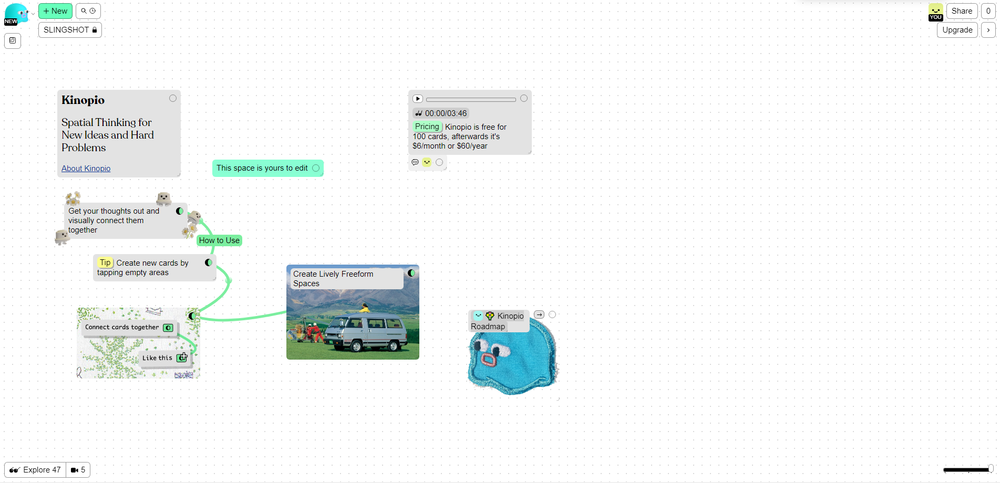

# Complete Guide For Solo Game Development

A complete guide that collects ideas, tools and resources for solo game development.

<a name="toc"></a>
## Table of Contents

> 1. [Introduction](#introduction)
>    - 1.1 [Purpose](#purpose)
>    - 1.2 [Important Notes](#important-notes)
> 2. [A Range of Responsibilities](#responsibilities)
>    - 2.1 [Design](#design)
>    - 2.2 [Engineering](#engineering)
>    - 2.3 [Art](#art)
>    - 2.4 [Writing](#writing)
>    - 2.5 [Management](#management)
> 3. [Getting Started](#getting-started)
>    - 3.1 [Finding Ideas](#finding-ideas)
>    - 3.2 [What to Learn (First)](#learn)
> 4. [Phases of Game Development](#phases)
>    - 4.1 [`Concept Phase`](#concept-phase)
>    - 4.2 [`Pre-Production`](#pre-production)
>    - 4.3 [`Production`](#production)
>    - 4.4 [`Post-Release`](#post-release)
> 5. [Distribution](#distribution)
> 6. [General Resources](#resources)

<a name="introduction"></a>
## 1. Introduction

This guide aims to provide a flexible tool for getting started on game development. It will clarify in detail what is necessary to produce a game from start to finish and distribute it, help you create your own workflow and collects unique and unconventional resources for improving your creative process.

Specifically, this guide will cover the different areas of responsibility that you'll be covering, as well as the individual phases of game development, with specific information on the various goals, tools used, strategies for organization, and learning material - always with a focus on *solo* development.

<a name="purpose"></a>
### 1.1 Purpose

If you are an aspiring indie game developer of any skill level, this can serve as a blueprint or valuable reference. If you are a seasoned veteran, this may serve as little more than an interesting glimpse into my process for [`GHOSTS & GLITTER`](https://www.youtube.com/@ghostsnglitter) - although any input from experts is welcome!

Because this process is still WIP, I'm constantly trying to develop it further, always with these principles in mind:

```
Maximize
- Flow
- Experimentation
- Quality of final result
```

```
Minimize
- Cost (time, money, effort)
- Boring work with boring decisions
```

<a name="important-notes"></a>
### 1.2 Important Notes

Before we go any further, a few important notes up front:
- This guide covers game development in *Unity* (although this only really becomes important during production).
- I am writing this guide alongside the development of my first game, `SLINGSHOT`, which I will be using as an example throughout.

[[Back to Top]](#complete-guide-for-solo-game-development)

<a name="responsibilities"></a>
## 2. A Range of Responsibilities

XXX

<a name="design"></a>
### 2.1 Design

XXX

<a name="engineering"></a>
### 2.2 Engineering

XXX

<a name="art"></a>
### 2.3 Art

XXX

<a name="writing"></a>
### 2.4 Writing

XXX

<a name="management"></a>
### 2.5 Management

XXX

[[Back to Top]](#complete-guide-for-solo-game-development)

<a name="getting-started"></a>
## 3. Getting Started

XXX

<a name="finding-ideas"></a>
### 3.1 Finding Ideas

A game idea is just that - an idea, like `2D game where you can perform a "slingshot" move by clicking and dragging the player character`. No specifics are required at this stage.

<a name="brainstorming"></a>
### 1.1 Brainstorming

A spontaneous, unorganized brainstorming session is always a good way to capture your game idea(s) for the first time. Having it written down clears up space in your mind and helps you remember all of the details you though about. It can also be helpful for playing around with different versions of the same idea. A good web application for brainstorming is [`Kinopio`](https://kinopio.club/):



It serves as a virtual whiteboard and can help you visually organize and connect ideas. I mostly use it temporarily for mind-mapping and instead collect the most promising game ideas as notes in my [`OneNote`](https://www.onenote.com/?public=1) notebook (which I use for other stuff, too). This makes it easier to quickly write down ideas on my mobile phone.

<a name="inspiration"></a>
### 1.2 Inspiration

Personally, I often can't stop my brain from constantly producing new game ideas, but sometimes I get stuck on something when trying to develop them further. The following approaches can help you find inspiration and getting unstuck:
- *Play games*: Start by playing games, from different genres and platforms, and including games you have already played. Analyze what you enjoy about them, what exactly draws you in. What about them is unique or makes you want to keep playing?
- *Identify a problem to solve*: Think about problems that you or others face in their daily lives. This could be anything from a lack of motivation to exercise to difficulty in learning a new language. Brainstorm ways that a game could help solve this problem.
- *Look for inspiration in other media*: Draw inspiration from books, movies, and TV shows. Consider how you could adapt a particular story or concept into a game.
- *Explore new technology*: Keep up-to-date with new technology and innovations in the gaming industry. Consider how new hardware, such as virtual reality headsets or haptic feedback controllers, could be used to create new gaming experiences.
- *Consider your own passions and interests*: Think about your own hobbies and interests. Consider how you could incorporate these into a game. For example, if you enjoy hiking, you could create a game that simulates a hiking adventure.
- *Combine different ideas*: Try combining different ideas to create something unique. For example, you could combine a puzzle game with a platformer or a survival game with a city-builder.
- *Collaborate with others*: Brainstorm with others and collaborate on game ideas. Consider working with people from different backgrounds and skill sets, such as artists or programmers.
- *Think about your target audience*: Consider who you want to make games for and what they would enjoy. Think about the age group, interests, and gaming experience of your target audience.

<a name="learn"></a>
### 3.2 What to Learn (First)

XXX

[[Back to Top]](#complete-guide-for-solo-game-development)

<a name="phases"></a>
## 4. Phases of Game Development

This is the main part of the guide. What follows are short descriptions of the different phases of game development, with the titles linking to the detailed articles.

<a name="concept-phase"></a>
### 4.1 [Concept Phase](Phases/1_ConceptPhase.md/#concept-phase)

In the Concept Phase, you will funnel your many ideas into a single, clearly defined Game Concept and critically evaluate it. If you are satisfied, you will make the commitment to move into Pre-Production.

<a name="pre-production"></a>
### 4.2 [Pre-Production](Phases/2_PreProduction.md/#pre-production)

During Pre-Production, you are going to hash out the most important design decisions. This is done through an iterative process of design and prototyping. You will also consider the resources that will be needed and draw up a plan for the realisation of your game - including an initial timeline - so that you can move on to Production.

<a name="production"></a>
### 4.3 [Production](Phases/3_Production.md/#production)

In Production, you will implement the specified design. This too is an interative process consisting of different stages, during which the design may need to be updated. The implementation is accompanied by consistent content preparation for public presentation of the game - with an increased commitment towards the release, which will mark the end of this phase.

<a name="post-release"></a>
### 4.4 [Post-Release](Phases/4_PostRelease.md/#post-release)

The Post-Release period is about updating and improving the game, engaging with the community, as well as potentially developing additional content.

[[Back to Top]](#complete-guide-for-solo-game-development)

<a name="distribution"></a>
## 5. Distribution

XXX

[[Back to Top]](#complete-guide-for-solo-game-development)

<a name="resources"></a>
## 6. General Resources

XXX

[[Back to Top]](#complete-guide-for-solo-game-development)